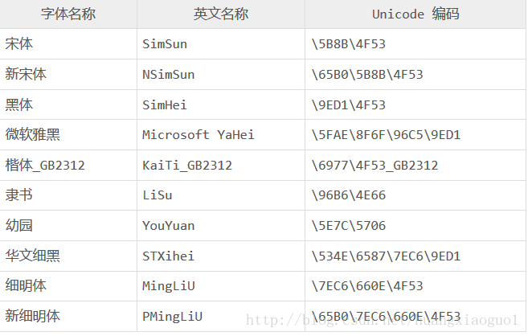

# 1、CSS

层叠样式表

~~~
由选择器
~~~

## 1.1 css的书写位置

~~~
1、内嵌式
	通过选择器进行分离，是将css代码嵌入到html文件中，css代码和html代码相对分离
2、行内式
	通过style属性将css代码直接写在标签中；不推荐使用，耦合度高，不容易维护
3、外链式
	通过link标签中的href属性加载独立的css文件，是将css代码单独写在文件中，css代码和html代码绝对分离，代码耦合度极低；其中link标签写在head标签中
~~~

## 1.2 层叠性

~~~
层叠性：不同选择器、书写方式对同一个标签的作用效力
	不同属性都可以实现；相同属性，在权重相同时后定义的会层叠（覆盖）先定义的
	
选择器权重：
	标签选择器< 类选择器< id选择器< 行内书写方式< !important
	    1		10		 100		1000		无穷大
书写方式权重：就近原则
 	外部式< 内嵌式< 行内式；其中内嵌式要写在引入外部式的后面
 	
 总结：权重不同看权重，权重相同看位置；选择器的优先级高于位置的优先级
~~~

## 1.3 继承性

~~~
继承性：标签可以继承父辈元素关于设置文本的属性
	继承的权重为0，即继承来自父类的属性会被自己的相同属性覆盖掉
~~~

标签会默认自带一些css属性

### 1.3.1 h标签的继承性

~~~
h标签默认设置了font-size和font-weight等，继承的自豪和加粗被自身层叠
~~~

### 1.3.2 a标签的继承性

~~~
a标签默认设置了color和cursor等，继承的颜色被自身层叠了
~~~

## 1.4 标签初始化

又叫清除标签默认样式

~~~
标签会自带一些属性，需要对这些属性进行清零或者初始化工作
	1、* 星号是通配符，表示所有的html标签;真正工作的时候不要使用，会降低代码效率
		*{
			margin:0;
			padding:0;
		}
	2、将用到的标签进行初始化，提高代码执行效率;工作中常使用
		body,h1,h2,h3{
			margin:0;
			padding:0;
		}
~~~

# 2、选择器

~~~
选择器：用于关联标签，对标签进行属性设置

选择器{
	属性：属性值
}

基础选择器：标签选择器 类选择器 id选择器
复合选择器：将基础选择器结合使用 后代选择器
~~~

## 2.1 标签选择器

对当前页面中所有的标签起作用

~~~css
tab{
    属性：属性值
}
~~~

## 2.2 类选择器

对标签中所有相同的class属性起作用

~~~css
.class{
    属性：属性值
}

命名规范：
  开头不能用数字开头，可以用字母或者下划线开头，加上字母、数字、下划线、中划线
  建议使用驼峰命名法

多类名调用：可以通过空格设置多个class选择器 class='class class1 class2'
~~~

## 2.3 id选择器

对标签中唯一的id属性起作用

~~~css
#id{
    属性：属性值
}

id名称是页面中唯一的，命名规范是和类名的是一样
~~~

## 2.4 后代选择器

### 2.4.1 普通后代选择器

~~~
基础选择器 后代选择器{
	属性：属性值
}

其中每一个空格就可以跟一个后代选择器，后代选择器也是基础选择器的用法；如果后代选择器唯一，可以省略中间辈分的选择器

后代选择器的优先级：
	根据权重进行后代选择器的相加，数字越大，优先级越高
~~~

### 2.5.2 一级后代选择器

~~~
基础选择器>ul>li
	只会选择后代选择器中的第一级，其余标签不会被选
~~~

## 2.5 并集选择器

~~~
并集选择器：将多个选择器用逗号隔开，实现共同的属性
	.box span,.box p .box .one{
		xxx
	}
~~~

## 2.6 交集选择器

用于精确定位共同选择器的位置

~~~
同时具备多个选择器条件；并集选择器不能使用后代
选择器1.选择器2（交集选择器）{
	//多个选择器只对其交集起作用
}
~~~

## 2.7 关系选择器

- 兄弟选择器

~~~
//下一个兄弟选择器；必须是下一个兄弟选择，隔一个不行
h1+b{
	属性：value；
}
~~~

- 后面所有兄弟元素选择器

~~~
//表示后面所有p元素
h~p{
	属性：value；
}
~~~

## 2.8 属性选择器

~~~
div[class]：表示有class属性名的元素
div[class="box"]:表示class属性值等于box的元素
div[class *="box"]:表示class属性值中任意位置包含box的元素
div[class ^="box"]:表示class属性值以box开始的元素
div[class $= "box"]:表示class属性值以box结束的元素
div[class ~= "box"]:包含独立单词box的元素,即不与其他单词连着
~~~

## 2.9 伪类选择器

- 受其他元素影响的

~~~
li:first-child{
	//后代第一个子元素;没有父元素会自动选择所有带有子元素中的元素，并会被其他元素影响第一个元素位置
}

li:last-child{
	//后代最后一个子元素
}

li:nth-child(n){
	//根据编号进行选择，编号从1开始；还可以是单词，odd是奇数，even是偶数；
	还可以是表达式（表达式必须是n，n从0开始）；倒数根据编号选择，
}

only-child //会找唯一的子元素
~~~

- 不受其他元素影响的

~~~
li:first-of-type{
	第一个子元素；只认准这个元素，不受其他元素影响
}

li:last-of-type{
	最后一个子元素
}

only-of-type //只找唯一的子元素
~~~

- 内容是空(内容包含：文本，标签，空格)

~~~
:empty{}
~~~

### 2.9.1 状态伪类

状态伪类：不同的状态显示不同的样式；权重是10

- focus

~~~
:focus 进入焦点属性生效
~~~

- checked

~~~
:checked 选中后生效
~~~

##### 补充：浏览器前缀

测试阶段属性，每个浏览器的实现有区别

| 浏览器  | 内核            | 前缀     |
| ------- | --------------- | -------- |
| chrome  | webkit（blink） | -webkit- |
| safari  | webkit          | -webkit- |
| opear   | webkit          | -o-      |
| firefox | gecko           | -moz-    |
| ie      | trident         | -ms-     |

- target

~~~
:target 目标伪类，直接跳转到目标位置
~~~

- 一些常用状态伪类

~~~

~~~

# 3、常用属性

## 3.1 设置颜色

### 3.1.1 颜色的基本概念

~~~
三基色: 红 黄 绿 
其他颜色是由三基色混合组成
~~~

### 3.1.2 设置方式

- 单词的方式

~~~css
color:red  由颜色的单词直接设置
~~~

- 十进制方式

~~~css
color:rgb(255,255,255)  
~~~

- 十六进制方式

~~~css
color:#000000  
每两位数字都相同可简写成
color:#000
~~~

## 3.2 盒子的属性

盒子：指的就是标签，在网页中都是由一个又一个大大小小的盒子组成

### 3.2.1 基本三属性

~~~
width:宽度
height:高度
background:背景色
~~~

### 3.2.2 显示模式及转换

- 显示模式类型

~~~
块级显示模式：独占一行，设置款到起作用，在没有设置固定宽度的情况下，和父元素的宽度一样
块元素：html、body、div、h1-h6、p、ul、ol、li、dl、dt、dd、hr、form

行内显示模式：一行有多个，设置宽高不起作用，尺寸由内容决定，可以对内容操作改变宽高；在没有内容时，宽高是0，当行内元素有一个及以上的空格时，显示效果之前会有一个默认的间距
行内元素：span a b strong i em u ins s del

行内块显示模式：一行有多个，设置宽高起作用
行内块元素：img 表单标签
~~~

- 显示模式的转换

~~~
其他显示模式转换成行内块显示模式：
display:
	inline-block 转换成行内块

其他显示模式转换成块级显示模式：
display:
	block 转换成块级
~~~

## 3.3 文本属性

文本分为四条线：顶线、中线、基线、底线

~~~
由于img是行内块元素，底部和文本的基线对其，所以会有一部分留白
解决方案：
	1、将行内块转为块元素：display：block
	2、将字号设置为0：font-size：0
~~~

行间距：多行文本，行与行之间的间距，

~~~
text-align:center 能让标签中的文本和行内元素在父元素中水平居中
text-decoration：overline顶划线  underline下划线  line-through中划线  none去掉线
line-height: 行高，设置文本在元素中垂直方向的位置，当盒子没有设置固定高度时，高度会随着行高的变化而变化，
	高度就是行高的值，因为文本始终要保持垂直居中于盒子，当盒子设置固定高度时，
	高度不会随着行高的变化而变化，当希望一个元素中的文本垂直居中与这个元素时，行高等于盒子的高度
~~~

- 字体可设置多个属性，用逗号隔开

  

  - 阴影属性

  ~~~
  text-shadow ：水平偏移 垂直偏移 模糊程度 颜色；并且文字阴影可以设置多组
  可以根据阴影属性实现凹凸效果、文本边框等
  ~~~

  

  

## 3.4 复合属性

单属性：一个属性名对应一个属性值（单属性要写在符合属性之后，否则会被符合属性覆盖）

复合属性：一个属性名对应多个属性值，可以直接配置

- font

~~~
字体单属性：
	font-size: 70px --字号
	font-weight: 700 --粗细
	font-style: italic --倾斜； normal --正常
	font-family:"黑体" --字体
字体复合属性：
	font:70px 700 italic "宋体"
~~~

- border

~~~
边框单属性：
	border-wedth:5px --边框宽度
	border-style: solid --实线 dashed --虚线 dotted --点状线
	border-color: red --边框颜色
	border-left 左边框 border-right 有边框 border-top 上边框 border-bottom 下边框
边框复合属性：
	border: 5px solid red
~~~

- background

~~~
背景单属性：
	background-color:red --背景颜色
	background-image:url --背景图
	background-repeat:repeat --平铺 repeat-x --水平平铺 repeat-y --垂直平铺 no-repeat 不平铺
	background-position:left center right --水平位置 top center bottom --垂直位置  也可以用像素点形式表示
背景复合属性：
	background：背景色 背景图 平铺方式 水平位置 垂直位置
~~~

## 3.5 溢出

~~~
overflow-x: 横向溢出
overflow-y：纵向溢出
overflow:横纵向同时设置
	visible - 默认。溢出没有被剪裁。内容在元素框外渲染
  hidden - 溢出被剪裁，其余内容将不可见
  scroll - 溢出被剪裁，同时添加滚动条以查看其余内容
  auto - 与 scroll 类似，但仅在必要时添加滚动条
~~~

## 3.6 背景属性

- 背景裁剪

~~~
backgroud-clip:
	content-box:从content区域可见
	padding-box:从padding区域可见
	border-box:默认值，从边框区域可见
~~~

- 背景起始位置

~~~
backgroud-origin:
	content-box
	border-box
	padding-box:默认值
~~~

- 背景缩放

~~~
background-size:
	宽度 高度；单位为px或百分比，百分比相对于盒子的宽高
	
	cover:按照合资的最长边铺满，为了保证盒子不变形，图片会有一部分被截掉
	contain：按照盒子的最短边铺满，为了保证图片不变形，图片会有一部分留白
~~~

- 滚动背景和固定背景

~~~
background-attachment:
	scroll:默认值，滚动背景，背景图默认在盒子内部的左上，当页面滚动时，盒子会跟着页面向上移动，背景图会跟着盒子移动
	fixed：背景图在浏览器的左上，相对于浏览器的位置固定不变，不会随着盒子的移动而进行位置的变动
~~~

- 多重背景

~~~
background:url(),url(); 根据书写顺序从上到下依次叠加
~~~

- 过滤器模糊属性

~~~
filter:blur(npx)
~~~

# 4、块元素

## 4.1 盒子模型

~~~
padding ：内边距
border ：盒子厚度
margin ：外边距
~~~

### 4.1.1 padding

盒子内边距：content区域到盒子边界的距离；当盒子设置内边距后，会撑大盒子的尺寸。为了保证盒子尺寸不变，又需要有内边距效果，要想赢的从盒子的宽高减去撑大的尺寸

~~~
内边距单属性：
	padding-left：左内边距
	padding-top：上内边距
	padding-right：有内边距
	padding-bottom：下内边距
复合属性：
	padding：一个值，上右下左；两个值，上下 左右；三个值：上 左右 下；四个值：上 右 下 左
	
padding减宽度的场景：
	当块元素没有设置固定宽度时，宽度和父元素一样，给该元素设置水平方向的padding时，不会撑宽盒子，会从content
	自动减去padding值，宽度的尺寸是不变的
	当块元素设置固定宽度时，此时设置水平方向的padding，盒子的尺寸会变大
~~~

### 4.1.2 margin

盒子外边距：盒子与盒子之间的间距

~~~
外边距单属性：
	margin-left
	margin-right:默认就有的特征值
	margin-top
	margin-bottom
外边距复合属性：
	同padding一样
	
外边距的合并：
	垂直排列的两个块元素，分别给上面的盒子设置向下的外边距和给下面的盒子设置向上的外边距，此时会形成外边距合并。
	当两个值相同时，就是该值，当两个值不同时，是较大的那个值
外边距塌陷：
	嵌套的两个块元素，给子元素设置向上的外边距，此时父元素会跟着掉下去，形成了外边距塌陷
	解决方案：
		1、给父元素设置上边框
		2、给父元素设置overflow属性
			overflow：scroll --滚动溢出，hidden --溢出隐藏，auto --当内容超出元素时，自动设置滚动条
			word-break: break-all --强制换行
			white-space：nowrap --强制不换行
			letter-spacing：0px --字边距
		3、给父元素设置浮动
		4、给子元素设置浮动
		
margin: 0 auto ;设置盒子（块元素）水平居中
~~~

### 4.1.3 border

~~~
border 边框；有：宽度，样式，颜色三个属性

宽度：
	1px
样式：
	solid 实线
			  虚线
颜色：
	#ffffff
	rgb(255,255,255)
~~~

## 4.2 块元素的属性

### 4.2.1 块元素的默认宽度

~~~
块元素的宽度不设置固定宽度时，宽度和父元素（content区域）一样
	块元素的默认面积组成：margin+border+padding+
~~~

## 4.3 圆角属性

    ~~~
    单属性：
    	border-top-left-radius: px/ %;或者 水平 垂直可以分别单独设置
    	border-top-right-radius
    	border-bottom-right-radius
    	border-bottom-left-radius
    复合属性：
    	border-radius:左上 右上 右下 左下;或者 左上和右下 右上和左下；再或者 左上 右上左下 右下
    	
    ~~~

## 4.4 怪异盒子模型

~~~
box-sizing:content-box
	标准盒子模型：盒子在网页中的尺寸=content+padding+border，当盒子设置padding和border后盒子的尺寸会变大
box-sizing:border-box
	怪异盒子模型：盒子在网页中的尺寸=content+padding+border，当盒子设置padding和border后盒子的尺寸不会变大;
	一定要设置盒子的宽高
~~~

## 4.5 盒子阴影属性

~~~
box-shadow:水平偏移 垂直偏移 模糊程度 扩展 颜色 inset向内阴影（默认向外）
~~~

# 5、渐变

## 5.1 线性渐变

~~~~
就是沿着一条轴线从一个颜色值逐渐过渡到另一个颜色值

background-image:linear-gradient(to bottom,red,yello,blue);方向默认从上往下,渐变最少两个颜色
	to bottom 从上到下
	to top 从下至上
	to right 从左至右
	to left 从右至左
	to left top 从右下到左上
	渐变不仅可以设置方向，还可以设置角度: 45deg,正值是顺时针，负值是逆时针
	还可以对渐变颜色设置范围：red 50px
~~~~

## 5.2 重复线性渐变

~~~
就是将线性渐变重复平铺
background-image:repeated-linear-gradient(to bottom,red,yellow,blue)
~~~

## 5.3 径向渐变

~~~
从原点到半径的渐变效果；效果是从圆心到最远角的渐变

background-image:radial-gradient(circle closest-side,red,yellow,blue)
	closest-side:指定径向渐变的半径长度为从圆心到离圆心最近的边
	closet-corner:指定径向渐变的半径内长度为从圆心到离圆心最近的角
	fathest-side:指定径向渐变的半径长度为从圆心到离圆心最远的边
	fathest-corner:指定径向渐变的半径长度为从圆心到离圆心最远的角

改变圆心的位置：
	fathest-side at 50px 50px;坐标相对于圆心分别进行水平偏移和垂直偏移
~~~

## 5.4 重复镜像渐变

~~~
将径向渐变进行重复平铺效果
repeated-radial-gradient
~~~

## 5.5 过渡属性

[贝赛尔曲线网址](https://cubic-bezier.com/#.17,.67,.83,.67)

~~~
元素中的属性值，从一个值逐渐到达某个值，这个过程就是过渡
过渡的单属性：
	transition-property:width;需要过渡的单属性
	transition-duration:秒/毫秒;过渡的时间
	transtion-timing-function:ease;过渡的方式
		ease:平滑过渡
		linear:线性过渡
		ease-in:由慢到快
		ease-out:由快到慢
		ease-in-out:由慢到快再到慢
		step-start:等同于step（1，start）
		
过渡复合属性：
	transition:all ease 0.5s
~~~

# 6、浮动

浮动，是一个属性：float；之前学习的三种显示模式被称为标准流，复工是一个脱离标准流的状态，也被称为浮动流。曾经，浮动最初是为了实现文本环绕效果的；目前，浮动就是用来做横向布局的。浮动布局横向盛不下会自动换行，设置浮动后，设置宽高才会起作用。

## 6.1 浮动类型

~~~
float:left --左浮动
	当元素设置浮动属性后，会按照标签书写顺序，依次排列在包含块的左上。浮动只会对后面的元素造成影响
float:right --右浮动
	浮动元素按照标签的书写顺序在父元素内部的右上方依次排列

行内块布局问题：代码换行会有默认间距，行内块是沿基线对齐（底对齐），当给元素设置垂直方向的内外
	边距时，会影响周围的元素
行内元素布局问题：代码换行会有默认间距，行内元素时沿基线对齐（底对齐），当给元素设置垂直方向的
	内外边距时，由于受基线对齐的限制，垂直方向的内外边距是不起作用的
	
浮动横向布局：没有代码换行的间距，设置自身内外（垂直）边距不会影响周围的元素
~~~

## 6.2 浮动造成的影响及解决方案

~~~
影响：
	当子元素是浮动时，父元素没有设置固定高度，由于子元素是飘起来的状态，父元素会认为没有内容撑开自身
	的高度，此时造成高度塌陷，父元素的高度是0
	浮动元素最终是给父元素造成影响，进而影响到父元素的兄弟元素
解决方案：
	1、给父元素设置overflow属性，子元素可能会溢出父元素
	2、额外标签法：
		clear:both;父元素的最后，设立一个空标签并设置该属性，清除（关闭，结束）之前元素中浮动造成影
		响，让浮动元素占位置；但是过多的空标签会影响代码执行效率
	3、父元素调用clearFix类名，会自动生成类似于空标签的伪标签。通常使用该解决方案
		.clearFix::after{
			content:'';
			display:'';
			clear:both;
		}
	4、给父元素设置浮动：此方案需要正赶上父元素需要设置浮动的时候使用，否则会造成父元素的父元素塌陷问题
~~~

## 6.3 浮动布局中的问题

~~~
当子元素设置浮动后，高度超出父元素时，会影响到下面父元素中的浮动元素
~~~

# 7、定位

## 7.1 绝对定位：static

~~~
静态位置：static不受定位元素（top、bottom、left、right）的影响
{
	position:static;
}
~~~

## 7.2 相对定位：relative

~~~
相对定位：是相对于其自身的正常位置进行定位，定位元素会移动其自身位置
{
	position:relative;
	top:0;
	left:0;
}
~~~

## 7.3 固定定位：fixed

~~~
固定定位：将元素设置到浏览器窗口的一个具体坐标位置，固定定位的参考点永远是浏览器窗口
{
/固定位置:只需要设置两个定位属性，可用像素或百分比表示/
	position:fixed;
  left:0;
  right:0;
  top:0;
  buttom:0;
}
~~~

## 7.4 相对定位：absolute

~~~
相对定位 absolute是相对于其祖先元素进行定位，并会被定位元素影响位置；被定位的是除static之外的任何元素
{
	position:absolute;
	top:0;
	left:0;
}
~~~

## 7.5 粘性定位：sticky

~~~
粘性定位：根据用户的滚动位置进行定位；可以根据滚动位置在相对和固定之间切换，当滚动到达元素属性设置的位置便会自动转为固定位置，起到固定显示在页面内的效果
{
	position:-webkit-sticky;//safari浏览器
	position:stickyl
	top:0;//当向下滚动，会粘性定位在页面顶部
}
~~~

## 7.6 定位元素

~~~
对元素进行定位，相对于定位位置，对元素的位置进行移动
{
	position:规定元素的定位类型。
	bottom:设置定位框的底部外边距边缘
	clip:裁剪绝对定位的元素
	left:设置定位框的左侧外边距边缘
	top:设置定位框的顶部外边距边缘
	right:设置定位框的右侧外边距边缘
	z-index:堆叠元素；设置为-1，在所有其他页面元素之后显示
}
~~~

# 8、其他整合元素

## 8.1 css精灵

~~~
也叫css sprite 雪碧图；是背景图的一种技术。将一个一个小图合成一个大图，
只需要连接一次服务器，就可以一次性下载背景图的技术；降低资源访问占用。
{
	background:url("../img") no-repeat 0px 0px;//通过px对图片进行裁剪
	background-position: 0px 0px;//也可以通过此单属性进行裁剪
}
~~~

## 8.2 图标字体

[iconfont-阿里巴巴矢量图标库](https://www.iconfont.cn/)

~~~
图标字体：也是一种字体，就像微软雅黑、宋体；是ui设计师用AI软件设计的
使用：
	1、引入项目下面生成的fontclass代码（用于对图标字体进行处理）
	2、挑选相应的图标并获得类名，应用于页面（用于展示的图标字体）
~~~

## 8.3 伪元素

在元素内部有一前一后两个盒子，就是伪元素

~~~
::before
::after
伪元素默认是行内显示模式
~~~

# 9、 2d转换

## 9.1 位移

~~~
位移：
	水平，垂直
	transform:translate(100px,100px);还可以设置百分比，自身宽度的百分比
~~~

## 9.2 旋转

~~~
transform:rotate(90deg) 沿着z轴旋转，正值是顺时针旋转，负值是逆时针旋转

旋转轴：
	rotate:默认沿着z轴旋转
	rotateX:沿着x轴旋转，从右往左正值是顺时针，负值是逆时针
	rotateZ:沿着z轴旋转
	rotateY:沿着y轴旋转，从下往上看，正值是顺时针，负值是逆时针
旋转中心点：
	transform-origin:left center;九个点(左 中 右 上 中 下；默认中心)，还可以使用像素点定义中心点
~~~

## 9.3 缩放

~~~
transform:
	scale(0.2);一个值：宽度和高度同比例缩小
	scale(0.2,0.3);两个值，宽度和高度不同比例缩小
	大于1是放大，小于1是缩小
~~~

## 9.4 动画

~~~
animation-name:绑定动画的名称
animation-duration:动画持续时间
animation-timing-function:动画的过渡，线性或其他
animation-direction:动画的方向 normal reverse 
animation-iteration-count:动画的次数，默认一次
animation-delay:动画延时

@keyframes donghua{
	定义动画：定义一个关键帧区间
}
~~~

# 10、响应式

响应式即自适应，即面对不同大小的屏幕，会对布局进行合适的展示

## 10.1 左侧固定右侧自适应

左侧组件会随着页面宽度的变动保持不动，右侧和中间布局元素会随着页面的变动随之变动

~~~
借助外部盒子实现内部元素的自动压缩
~~~

## 10.2 双飞翼布局

即左右两边都会随着页面宽度的变动保持不变，中间的组件会随之缩小

~~~
min-width:最小宽度，页面宽度收缩到最小值之后就不会改变了
max-width:最大宽度，页面宽度放大到最大值之后就不会改变了
~~~

## 10.3 圣杯布局

待补充

## 10.4 媒体查询

[Apple (中国大陆) - 官方网站](https://www.apple.com.cn/)使用的是bootstrap框架，媒体查询语句。

~~~
媒体查询语句实际上也是css语句，会检测屏幕的宽高进行宽高的布局，实质上就是一个带条件的css语句

//@ 定义媒体查询的关键字
//在页面宽度大于等于500px的时候，当前媒体查询生效
@media(min-width:500px){
	div{
		width:800px;
	}
}

// and前后至少有一个空格，否则条件不生效
@media (条件1) and (条件2){

}

//横竖屏 landscape 横屏 portrait 竖屏
// screen 彩屏设备
@media(orientation:landscape) and only screen {

}

//媒体查询外链式引入
<link rel="stylesheet" type ="test/css" href=".css" media=(min-width:1000px)>
~~~

## 10.5 弹性布局

~~~
弹性布局：是父元素和子元素之间的关系，也叫伸缩布局、弹性盒子、伸缩盒子、flex布局，父元素叫做弹性空间，子元素叫做弹性元素或弹性项

	
开启弹性空间
	display:flex;
弹性元素在主轴上的位置分布（水平主轴）
	主轴：默认是水平方向，左边开始，右边结束
	侧轴（交叉轴、垂轴）：默认是垂直方向，上边开始，下边结束
			flex-firection:row-reverse 替换主轴和侧轴的位置
弹性元素在侧轴的位置分布（在当前行的位置分布）
	flex-start 居开始
	flex-end 居结束
	center 居中
	stretch 默认值，当弹性元素不设置高度时，高度和侧轴当前行的高度一样
	
justify-content: 
		space-around  空间包含元素
		space-between 元素包含空间
		space-evenly 空间包含元素（元素左右相等的间距）
		
弹性元素换行
	no-wrap 不换行，当弹性元素超出父元素时，会自身进行压缩
	wrap 换行（向下换行），当弹性元素超出父元素时，会换行
	wrap-reverse 反向换行（向上换行）

弹性元素的排序
	弹性元素在主轴上的顺序和书写顺序是保持一致的
	order:在弹性元素的最后，按order的编号进行排序
	
弹性元素的压缩率（收缩因子）
	flex-shrink:1;默认值是1，0是不压缩，每份压缩的数值
		每份压缩的数值px = 超出的数值 / 总份数
		元素剩余的宽度 = 自身宽度 - 每份压缩的数值 * 压缩的份数
~~~

